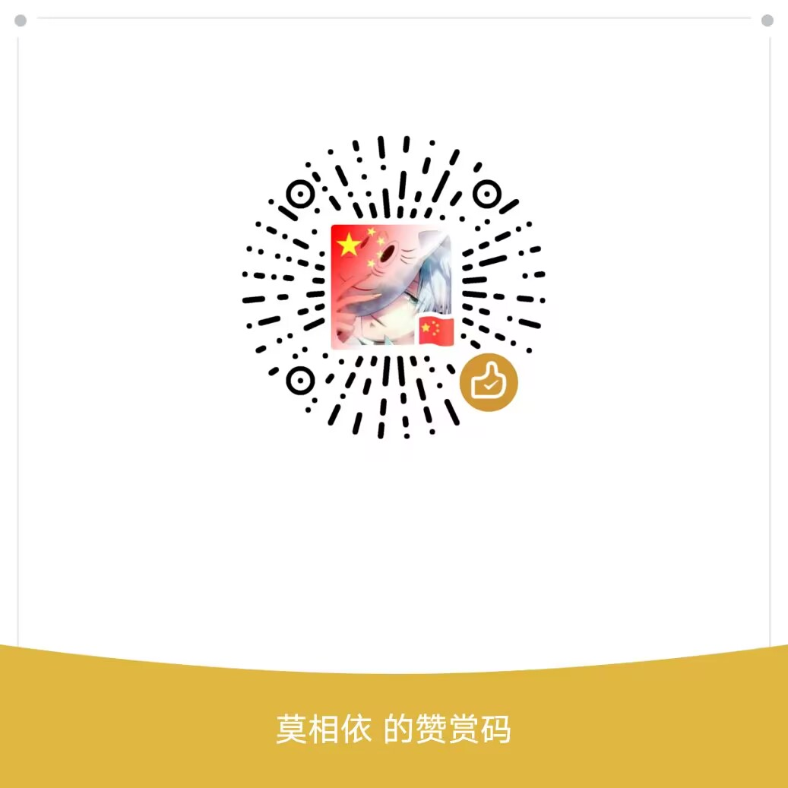

# 项目说明

- 本项目是使用 vuepress-theme-hope 进行搭建
- 本项目的使用：编程细胞の博客，用于分享一些学习案例

```
编程细胞の博客：http://blog.itzhang520.top/
vuepress 文档：https://www.vuepress.cn/
theme-hope 文档：https://theme-hope.vuejs.press/zh/
部署命令：npm run deploy
```

<details><summary><strong style="color:#e96443;">👀[点击展开] 赞赏支持 </strong></summary>


</details>
